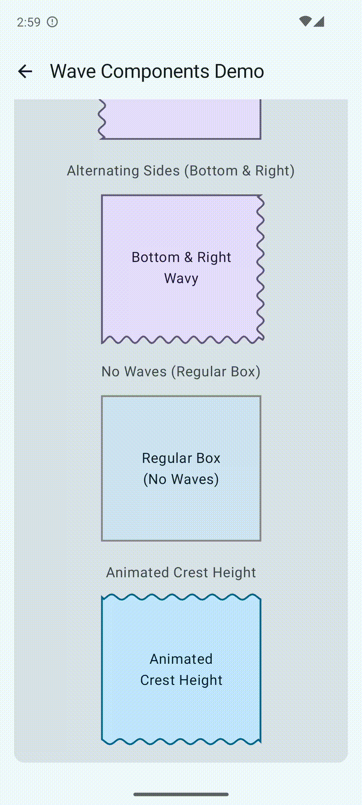
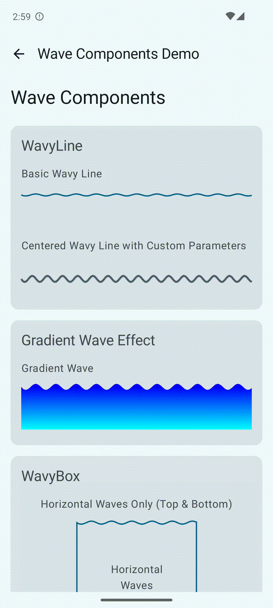
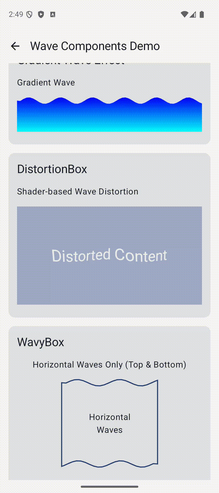

#  🤷‍♂️ Useless UI 🤷‍♂️

Useless UI is a Jetpack Compose library containing fun, but probably useless UI components. My goal is for each component module to be available as an independent Gradle dependency and also as a suite that can be imported as one dependency. This repo also contains a sample app to showcase these components.

I will be adding to this over time as I get inspiration, tinker with things, and create components I want to reuse in other side projects.

## Components

### ShatterableLayout

| ShatterableLayout | ShatterPager |
| --- | --- |
|  |  |

This component allows its children to be shattered into many pieces. The exact properties of this shattering are configurable via `ShatterSpec`. `ShatterableLayout` captures a bitmap of its content (the timing of this can be controlled via `CaptureMode`) and then uses that for the shattering effect. The shattering is done using a Voronoi Diagram algorithm to create non-overlapping random polygons. I was inspired by the glass shattering transition in Powerpoint, which I recall fondly adding to all of my presentations despite being completely unnecessary and annoying.

You can also do this in reverse if you want to "unshatter" something which looks neat.

#### Installation
[](https://search.maven.org/artifact/io.github.seankenkeremath/shatterable-layout)

```
dependencies {
    implementation("io.github.seankenkeremath:shatterable-layout:0.1.0") // Replace with latest version above
}
```

#### Usage

##### ShatterableLayout

```kotlin
// Basic usage
ShatterableLayout(
    progress = shatterProgress, // 0f = intact, 1f = fully shattered
    modifier = Modifier.fillMaxWidth()
) {
    // Your content here
    Text("Example content")
}

// With more options
ShatterableLayout(
    progress = shatterProgress,
    captureMode = CaptureMode.LAZY,
    shatterSpec = ShatterSpec(shardCount = 30, velocity = 300f), // ShatterSpec defines the properties of the shattering effect. There are many other parameters, but default values will be applied if not specified.
    modifier = Modifier.fillMaxWidth()
) {
    // Your content here
}
```

##### ShatterPager

```kotlin
// Basic usage
ShatterPager(
    state = pagerState,
    modifier = Modifier.fillMaxSize()
) { page ->
    // Your page content here
    Box(Modifier.fillMaxSize()) {
        Text("Page $page")
    }
}

// With custom shatter effect
ShatterPager(
    state = pagerState,
    shatterSpec = ShatterSpec(shardCount = 20),
    modifier = Modifier.fillMaxSize()
) { page ->
    // Your page content here
}
```

#### Key Classes and Functions

##### ShatterSpec
Configures the shatter effect properties:
```kotlin
ShatterSpec(
    shardCount: Int = 15,
    easing: Easing = FastOutSlowInEasing,
    velocity: Float = 300f,
    rotationXTarget: Float = 30f,
    rotationYTarget: Float = 30f,
    rotationZTarget: Float = 30f,
    velocityVariation: Float = 100f,
    rotationXVariation: Float = 10f,
    rotationYVariation: Float = 10f,
    rotationZVariation: Float = 10f,
    alphaTarget: Float = 0f,
)
```

##### CaptureMode
Controls when the underlying bitmap is captured for the shatter effect:
- `CaptureMode.AUTO`: Automatically recaptures when content changes based on size or the `contentKey` param for `ShatterableLayout` 
- `CaptureMode.LAZY`: Only captures once shatter progress is > 0. This can be more memory efficient depending on your use case.

#### Optimizations
* Individual shards are rendered using cropped, smaller bitmaps to conserve memory
* Bitmap capturing can be done lazily or immediately depending on your use case
* The shattering animation of individual shards are performed at the graphics layer
* Recompositions are minimized

#### Future improvements + optimizations
* We can avoid creating cropped bitmaps entirely if Compose supports either **1)** `graphicsLayer` animations on Canvas objects (we can crop the parent bitmap in the Canvas) or **2)** cropping inside `graphicsLayer` with an arbitrary path (only simple shapes are currently supported)
* Capturing of the bitmap and creation of Voronoi cells can be offloaded to a background thread

### Wavy Components

Note: In these screenshots the "jump" is just coming from the GIF repeating. 
These components are designed to seamlessly repeat the wave pattern.

|                                                |                                                |                                                        | 
|------------------------------------------------|------------------------------------------------|--------------------------------------------------------| 
|  |  |  | 

These components give you the building block to create wavy effects in your UI. 
That includes a normal `WavyLine` as well as a `WavyBox` where any combination of sides can be wavy. 
The waves are customizable via `WavySpec` which can easily be animated or controlled by the parent Composable.
`WavyBox` supports several draw styles including via `Brush` or Color.

This library also includes a `wavyPathSegment` function you can use in Path to draw a wave between 2 points for your own custom UI.

#### Installation
[](https://search.maven.org/artifact/io.github.seankenkeremath/waves)

```
dependencies {
    implementation("io.github.seankenkeremath:waves:0.1.1") // Replace with latest version above
}
```

#### Usage

##### WavyLine

```kotlin
// Basic usage with animation managed by the component
WavyLine(
    modifier = Modifier
        .fillMaxWidth()
        .height(50.dp),
    crestHeight = 8.dp,
    waveLength = 60.dp,
    color = Color.Blue,
    strokeWidth = 2.dp
)

// With animation state-hoisted to allow control from the parent
val animationProgress = remember { mutableStateOf(0f) }
WavyLine(
    progress = animationProgress.value,
    modifier = Modifier
        .fillMaxWidth()
        .height(50.dp),
    crestHeight = 8.dp,
    waveLength = 60.dp,
    color = Color.Red,
    strokeWidth = 2.dp,
    centerWave = true
)
```

##### WavyBox

```kotlin
// Basic usage with animation managed by the component
WavyBox(
    spec = WavyBoxSpec(
        topWavy = true,
        bottomWavy = true,
        leftWavy = false,
        rightWavy = false,
        crestHeight = 6.dp
    ),
    style = WavyBoxStyle.Outlined(
        strokeColor = Color.Black,
        strokeWidth = 2.dp
    ),
    modifier = Modifier.size(200.dp)
) {
    Text("Wavy Box")
}

// With animation state-hoisted to allow control from the parent
val animationProgress = remember { mutableStateOf(0f) }
WavyBox(
    progress = animationProgress.value,
    spec = WavyBoxSpec(
        topWavy = true,
        bottomWavy = true,
        leftWavy = false,
        rightWavy = false
    ),
    style = WavyBoxStyle.FilledWithColor(
        color = Color.Cyan,
        strokeWidth = 0.dp,
        strokeColor = Color.Transparent
    ),
    modifier = Modifier.size(200.dp)
)
```

##### DistortionBox

```kotlin
// Basic usage with animation managed by the component
DistortionBox(
    modifier = Modifier
        .fillMaxWidth()
        .height(200.dp)
) {
    Box(
        modifier = Modifier
            .fillMaxSize()
            .background(MaterialTheme.colorScheme.primaryContainer)
    ) {
        Text(
            "Distorted Content",
            style = MaterialTheme.typography.headlineMedium,
            color = MaterialTheme.colorScheme.onPrimaryContainer,
            modifier = Modifier.align(Alignment.Center)
        )
    }
}

// With animation state-hoisted to allow control from the parent
val time = remember { mutableFloatStateOf(0f) }
DistortionBoxImpl(
    time = time.value,
    modifier = Modifier
        .fillMaxWidth()
        .height(200.dp)
) {
    // Your content here
}
```

Note: The `DistortionBox` component requires Android 13 (API 33/Tiramisu) or higher to work as it uses RuntimeShader. The component applies a wave distortion effect to its content using a custom shader.

##### Custom Path with Wavy Segment

```kotlin
// Add a wavy segment to a path
Path().apply {
    moveTo(startX, startY)
    wavyPathSegment(
        animationProgress = animatedPhase,
        crestHeightPx = 20f,
        waveLengthPx = 100f,
        startPoint = Offset(startX, startY),
        endPoint = Offset(endX, endY)
    )
}
```

#### Key Classes and Functions

##### wavyPathSegment
Creates a wavy path between two points:
```kotlin
// Basic usage
wavyPathSegment(
    animationProgress = 0f,
    crestHeightPx = 10f,
    waveLengthPx = 50f,
    startPoint = Offset(0f, 0f),
    endPoint = Offset(100f, 0f)
)

// With Dp values
wavyPathSegment(
    animationProgress = 0f,
    crestHeight = 10.dp,
    waveLength = 50.dp,
    startPoint = Offset(0f, 0f),
    endPoint = Offset(100f, 0f),
    density = LocalDensity.current
)
```

#### Future improvements + optimizations
* I plan to build in support for a corner radius which will make the corners for wavy box look a bit cleaner as separate wave segments converge