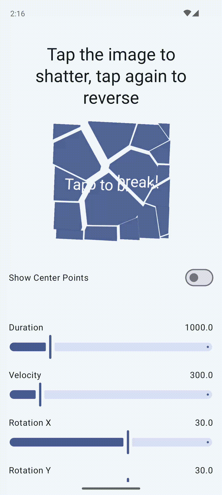

# Useless UI (WIP)

Useless UI is a Jetpack Compose library containing fun, but probably useless UI components. My goal is for each component module to be available as an independent Gradle dependency and also as a suite that can be imported as one dependency. This repo also contains a sample app to showcase these components.

I will be adding to this over time as I get inspiration, tinker with things, and create components I want to reuse in other side projects.

## Components

### ShatterableLayout

This is a Layout that allows it's children to be shattered into many pieces. The exact properties of this shattering are configurable via `ShatterSpec`. This Layout captures a bitmap of its content (the timing of this can be controlled via `CaptureMode`) and then uses that for shattering. The shattering is done using a Voronoi Diagram algorithm to create non-overlapping random polygons. I was inspired by the glass shattering transition in Powerpoint, which I recall fondly adding to 

You can also do this in reverse if you want to "unshatter" something which looks neat.

#### Optimizations
* Individual shards are rendered using cropped, smaller bitmaps to conserve memory
* Bitmap capturing can be done lazily or immediately depending on your use case
* The shattering animation of individual shards are performed at the graphics layer
* Recompositions are minimized

#### Future improvements + optimizations
* Create a "ShatterablePager"
* We can avoid creating cropped bitmaps entirely if Compose supports either **1)** `graphicsLayer` animations on Canvas objects (we can crop the parent bitmap in the Canvas) or **2)** cropping inside `graphicsLayer` with an arbitrary path (only simple shapes are currently supported)
* Capturing of the bitmap and creation of Voronoi cells can be offloaded to a background thread
* Pass in interpolation properties for shatter animation
